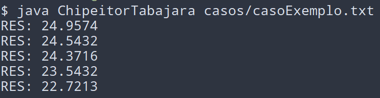

# Chipeitor Tabajara - Projeto e Otimização de Algoritmos - 2019/2

Implementação Java de um algoritmo genético para posicionamento de elementos em uma placa de circuito integrado. É utilizada a distância euclidiana, sendo que se deseja obter o menor resultado possível com a soma das distâncias entre os componentes em uma placa de tamanho *n X n* e *n^2* componentes. A configuração inicial da placa é lida de um arquivo (formato abaixo), sendo gravado um segundo arquivo conforme se obtém progresso na otimização, bem como a impressão da soma obtida.

- Formato (arquivo entrada/saída):  
    &nbsp;&nbsp;  3 18    &nbsp;&nbsp;&nbsp;              # Tamanho da placa e quantidade de conexões\
    &nbsp;&nbsp;  0 1 2   &nbsp;&nbsp;                    # Configuração da placa\
    &nbsp;&nbsp;  3 4 5   &nbsp;&nbsp;                    # ...\
    &nbsp;&nbsp;  6 7 8   &nbsp;&nbsp;                    # ...\
    &nbsp;&nbsp;  0 3     &nbsp;&nbsp;&nbsp;&nbsp;&nbsp;  # Conexão 1\
    &nbsp;&nbsp;  1 4     &nbsp;&nbsp;&nbsp;&nbsp;&nbsp;  # Conexão 2\
    &nbsp;&nbsp;  ...
    
- Distância:  
  
    
## Requisitos

JDK e JRE (testado com Oracle Java 11)

## Execução

- Compilação:

    javac ChipeitorTabajara.java

- Execução:

    java ChipeitorTabajara *arquivo_de_configuracao*

## Licença

[MIT](https://choosealicense.com/licenses/mit/)
